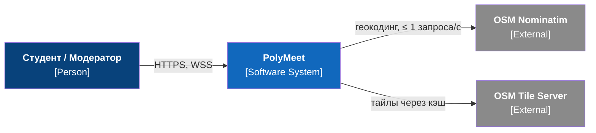
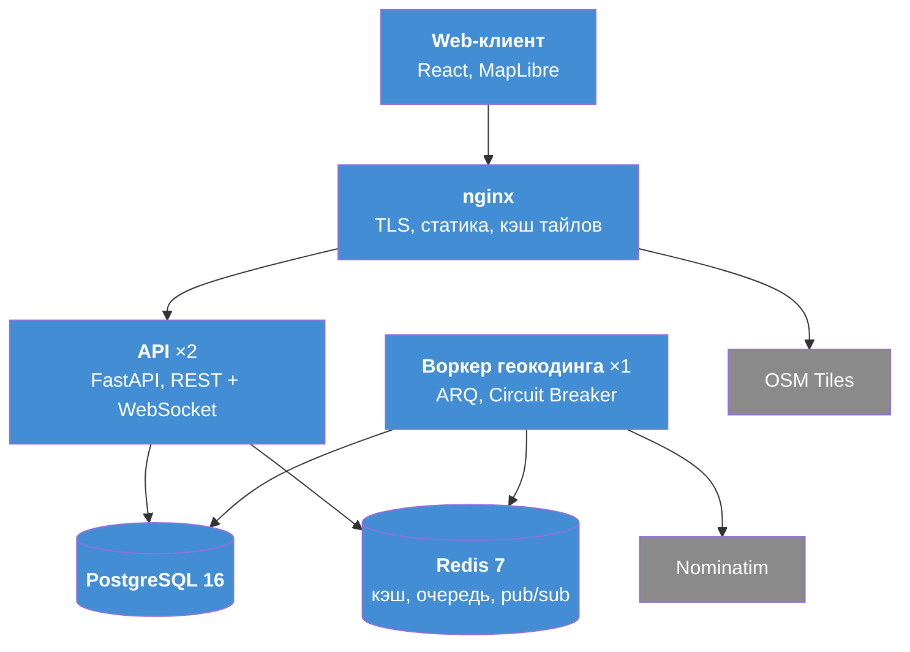
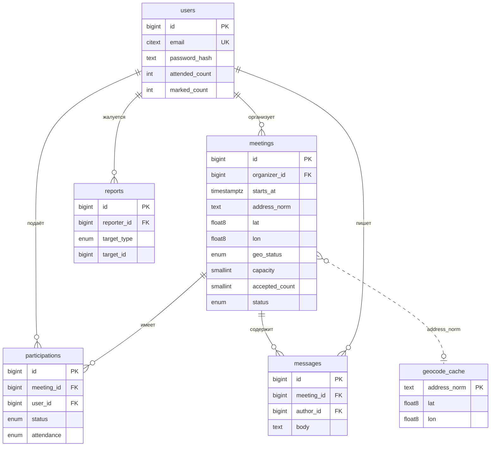
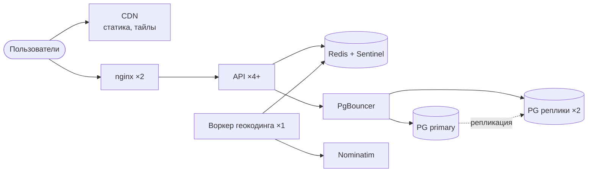

# PolyMeet - веб-платформа офлайн-встреч студенческого сообщества

## Этап 1. Проблема и тема

Студенту, который ищет компанию для подготовки к экзамену, игры в волейбол или поездки, приходится писать в десятки разрозненных чатов курса и общежитий, где объявление быстро теряется. Организатор до последнего не знает, сколько человек реально придёт, а участник - состоится ли встреча и где именно она пройдёт. В итоге часть встреч срывается из-за неявки, а часть студентов просто не находит 

**Проблема:** Высокая сложность организации офлайн-встречи для студента: поиск участников вслепую по общим чатам, неопределённость состава для организатора и неуверенность участника в том, что встреча состоится.

**Тема:** PolyMeet - веб-платформа для организации встреч студентов с геопривязкой мест, настраиваемым составом участников и подтверждением явки.

## Стек технологий

**Серверная часть** - Python 3.12, FastAPI, SQLAlchemy 2.0 (async) + asyncpg, Alembic для миграций, Pydantic v2 для валидации и контрактов. Фоновые задачи - ARQ поверх Redis. Аутентификация своя: JWT с ротацией refresh-токена, пароли под Argon2id. Логирование - structlog, JSON в STDOUT.

**База данных** - PostgreSQL 16 (требование ТЗ). Из расширений используем `earthdistance`/`cube` для поиска встреч по радиусу и `pg_trgm` для поиска по названию. Redis 7 - кэш и очередь задач.

**Интерфейс** - web-приложение: React 18 + TypeScript, сборка Vite, работа с API через TanStack Query, карта на MapLibre GL JS, оформление на Tailwind CSS. Telegram и TUI не используются.

**Внешняя зависимость** - OpenStreetMap Nominatim для геокодинга адресов и OSM tile server для тайлов карты. Nominatim ограничивает клиента одним запросом в секунду, поэтому все обращения к нему идут через кэш и фоновую очередь, а не из обработчика HTTP-запроса.

**Тестирование и сборка** - pytest с testcontainers для интеграционных тестов на реальном PostgreSQL, Vitest на фронтенде, Playwright для сквозного сценария. CI - GitHub Actions. Запуск - Docker Compose одной командой.

## Итоговый продукт

Развёрнутое одной командой `docker compose up` веб-приложение, в котором студент регистрируется, видит ленту ближайших встреч и карту, фильтрует их по категории, дате и радиусу, подаёт заявку на участие и переписывается в чате встречи. Организатор создаёт встречу с адресом и лимитом мест, принимает или отклоняет заявки, после встречи отмечает явку - из этого складывается видимая история надёжности участника. Есть роль модератора для обработки жалоб.

## Этап 2. Выработка требований

## Пользовательские сценарии

**US-1. Найти встречу рядом.**
Как студент, я хочу видеть список ближайших встреч с фильтрами по категории, дате и расстоянию, чтобы быстро найти, к чему присоединиться, не листая чаты.
- В ленте только будущие и опубликованные встречи, сортировка по времени начала.
- Фильтры: категория, дата, радиус от текущей геопозиции, наличие свободных мест.
- Переключение «список / карта» для встреч с известными координатами.

**US-2. Создать встречу с понятным местом.**
Как организатор, я хочу создать встречу, указав время, адрес и лимит участников, чтобы люди знали, куда и когда приходить, и не пришло вдвое больше, чем влезает.
- Адрес геокодируется, точка показывается на карте; её можно поправить вручную.
- Валидация: время начала в будущем, лимит от 2 до 100 участников.
- Если геокодер недоступен, встреча всё равно создаётся, координаты определяются позже фоновой задачей.

**US-3. Подать заявку и получить ответ.**
Как студент, я хочу отправить заявку на участие и быстро узнать решение, чтобы не гадать, ждут меня или нет.
- Повторная заявка на ту же встречу невозможна.
- Организатор видит список заявок и принимает или отклоняет их; при заполненном лимите заявка попадает в лист ожидания.
- Отмена участия освобождает место и поднимает первого из листа ожидания.

## Масштаб системы

Исходим из 10 000 уникальных пользователей в сутки. Допущения: 1,4 сессии на пользователя, около 12 просмотров экранов за сессию, 60% трафика приходится на пиковые 4 часа (обеденный перерыв и вечер).

**Чтение:** 10 000 × 1,4 × 12 ≈ 168 000 запросов, плюс около 2 000 служебных → **170 000 в сутки**.

**Запись:** создание встреч (2% пользователей) - 200, подача заявок (25%) - 2 500, решения по ним - 2 300, сообщения в чатах - 12 000, отметки явки и правки профиля - 1 000 → **18 000 в сутки**.

**Итого ≈ 188 000 запросов в сутки, соотношение чтения к записи ≈ 9:1.**

| Показатель | Значение |
|---|---|
| Средний RPS | 188 000 / 86 400 ≈ **2,2** |
| Пиковый RPS | 188 000 × 0,6 / 14 400 ≈ **7,8** |
| Проектный пик (с двукратным запасом) | **≈ 16 RPS** |
| Трафик API | ≈ 1 ГБ в сутки |

Нагрузка невысокая: один инстанс FastAPI на 2 CPU при времени ответа 150 мс держит порядка 120–150 RPS, то есть расчётный пик покрывается примерно с десятикратным запасом. Два инстанса разворачиваем не ради производительности, а ради отказоустойчивости и обновления без простоя.

## Отказоустойчивость

Единственная внешняя зависимость - картографический сервис Nominatim, который превращает адрес в координаты. Он же и самое слабое место: сервис публичный, разрешает не больше одного запроса в секунду и блокирует за превышение.

**Главное правило: отказ геокодера не должен ломать ни один сценарий.** Создание встречи обязано завершаться успешно, даже если внешний сервис полностью недоступен - адрес в этом случае сохраняется как текст, а координаты определяются позже.

**Кэширование.** Каждый разобранный адрес сохраняется в Redis на 30 суток и, кроме того, навсегда в отдельной таблице PostgreSQL. Студенческие встречи проходят в одних и тех же местах - корпуса, общежития, десяток кафе и парков рядом - поэтому большая часть запросов обслуживается из кэша и до внешнего сервиса не доходит. По оценке, из 200 создаваемых в сутки встреч наружу уходит около 40 запросов при разрешённых 86 400.

**Ограничение нагрузки.** Приложение никогда не обращается к геокодеру напрямую из обработчика запроса: все обращения идут через фоновую очередь, в которой работает ровно один исполнитель не чаще одного запроса в секунду. Сколько бы копий приложения ни было запущено, внешний лимит не будет превышен.

**Circuit Breaker («предохранитель»).** Если подряд идут ошибки или таймауты, система перестаёт обращаться к внешнему сервису на минуту, чтобы не тратить время на заведомо безнадёжные вызовы и не усугублять его состояние. После паузы делается один пробный запрос: успех - работа продолжается, снова ошибка - пауза повторяется. Восстановление происходит само, без ручного вмешательства.

**Уровни деградации:**

| Ситуация | Что делает система | Что видит пользователь |
|---|---|---|
| Всё работает | Кэш, при промахе - запрос наружу | Точка на карте появляется сразу |
| Геокодер отвечает медленно | Отменяем ожидание, ставим задачу в очередь | «Определяем точку на карте, адрес сохранён» |
| Геокодер недоступен | Работаем только из кэша, новые адреса ставим в очередь | Можно поставить точку на карте вручную |
| Redis недоступен | Берём кэш из PostgreSQL | Ничего, кроме небольшого замедления |
| PostgreSQL недоступен | Приложение сообщает о неготовности и выводится из балансировки | Страница ошибки, восстановление автоматическое |

Во всех случаях, кроме последнего, платформа остаётся работоспособной: лента, заявки, чат и отметка явки от внешнего сервиса не зависят вовсе.

## Этап 3. Архитектура и детальное проектирование

## 3.1. Анализ нагрузок

Исходные данные: 10 000 пользователей в сутки, 14 000 сессий, 60% трафика в пиковые 4 часа.

| Показатель | Значение |
|---|---|
| Чтение | 170 000 в сутки (лента 56 тыс., карточки 42 тыс., прочее 72 тыс.) |
| Запись | 18 000 в сутки (сообщения 12 тыс., заявки и решения 4,8 тыс., прочее 1,2 тыс.) |
| **Read : Write** | **≈ 9 : 1** |
| RPS: средний / пиковый / проектный | 2,2 / 7,8 / 16 |
| Трафик API | ≈ 1,2 ГБ в сутки без сжатия, ≈ 0,45 ГБ с gzip |
| Трафик всего (API, статика, тайлы) | ≈ 2,4 ГБ в сутки, в пик меньше 2 Мбит/с |
| Внешние запросы | Nominatim ≈ 40 в сутки; OSM-тайлы ≈ 4 000 в сутки (промахи кэша) |

**Диск на 5 лет:**

| Таблица | Строк в сутки | Строк за 5 лет | Объём |
|---|---|---|---|
| `messages` | 12 000 | 21,9 млн | 5,9 ГБ |
| `participations` | 2 500 | 4,6 млн | 0,5 ГБ |
| `meetings` | 200 | 365 тыс. | 0,4 ГБ |
| Остальные | - | - | 0,2 ГБ |
| Индексы | | | 1,9 ГБ |
| Запас на MVCC и WAL | | | 4,2 ГБ |
| **Итого** | | | **≈ 13 ГБ, выделяем том 40 ГБ** |

## 3.2. C4: Context и Container

## 3.3. Контракты API

Базовый путь `/api/v1`, формат JSON, авторизация `Bearer JWT`. Пагинация курсорная, ошибки в формате RFC 7807. Полная спецификация генерируется в `/api/docs` (OpenAPI).

| Метод и путь | Назначение | p95 |
|---|---|---|
| `POST /auth/register`, `/auth/login`, `/auth/refresh` | Регистрация, вход, ротация токена | 500 мс |
| `GET /meetings?lat&lon&radius_km&category&date&cursor` | Лента с фильтрами | 200 мс |
| `GET /meetings/map?bbox` | Точки на карте | 200 мс |
| `GET /meetings/{id}` | Карточка встречи | 150 мс |
| `POST /meetings` | Создание встречи | 300 мс, при промахе кэша геокодинга 2,5 с |
| `POST /meetings/{id}/applications` | Заявка (409 при повторной) | 300 мс |
| `DELETE /meetings/{id}/applications/me` | Отмена участия | 300 мс |
| `POST /applications/{id}/decision` | Принять или отклонить | 300 мс |
| `PUT /meetings/{id}/attendance` | Отметка явки | 300 мс |
| `GET /meetings/{id}/messages`, `GET /ws` | История чата и WebSocket | 150 мс, доставка ≤ 1 с |
| `POST /reports`, `POST /moderation/reports/{id}/resolve` | Жалоба и её разбор | 300 мс |
| `GET /health/ready` | Проверка готовности | 50 мс |

Нефункциональные требования: доступность ≥ 99,5%; таймауты: `statement_timeout` в PostgreSQL 3 с, запрос к Nominatim 5 с; лимиты: вход 5 в минуту с IP, запись 60 в минуту на пользователя.

## 3.4. Проектирование данных

| Индекс | Какой запрос обслуживает |
|---|---|
| `meetings (starts_at) WHERE status='published'` | Лента |
| `meetings USING gist (ll_to_earth(lat, lon)) WHERE status='published'` | Поиск в радиусе |
| `meetings USING gin (title gin_trgm_ops)` | Поиск по названию |
| `participations UNIQUE (meeting_id, user_id)` | Запрет повторной заявки |
| `participations (meeting_id, status, created_at)` | Список заявок, лист ожидания |
| `messages (meeting_id, id)` | История чата (keyset-пагинация) |

**Почему выдержит нагрузку:**
- В пик к БД идёт меньше 50 SQL-запросов в секунду, и все они по индексам.
- Прошедшие встречи переводятся в статус `finished`, поэтому частичные индексы содержат только ≈ 6 000 будущих встреч.
- Горячие данные занимают меньше 200 МБ и целиком помещаются в `shared_buffers`.
- Keyset-пагинация не замедляется с ростом таблиц.
- Счётчики `accepted_count` и `attended_count` избавляют от агрегации. Лишний участник сверх лимита не пройдёт: место занимается атомарным запросом `UPDATE ... WHERE accepted_count < capacity`.

## 3.5. Масштабирование ×10 (100 000 пользователей в сутки)

Нагрузка вырастет до 160 RPS в проектный пик, 7 000 WebSocket-соединений и ≈ 115 ГБ базы за 5 лет.

- **API:** 4 и больше экземпляров. Это возможно, потому что API не хранит состояния: чат между экземплярами идёт через Redis pub/sub.
- **БД:** PgBouncer, 2 реплики для чтения (соотношение 9 : 1 это позволяет), секционирование `messages` по месяцам.
- **Кэш ленты:** Redis на 30 с, ключ по ячейке geohash.
- **Тайлы:** CDN или собственные тайлы региона (PMTiles), чтобы не нарушать правила OSM.
- **Кэширование внешних запросов (защита от блокировки Nominatim):**
  - нормализация адреса и справочник популярных мест;
  - кэш Redis на 30 дней и постоянный кэш в PostgreSQL;
  - схлопывание одинаковых запросов (`job_id` равен хэшу адреса);
  - один воркер с общим лимитом 1 запрос/с;
  - Circuit Breaker.
- **Проверка на ×10:** около 600 внешних запросов в сутки, в пик ≈ 1,5 в минуту при лимите 60.
